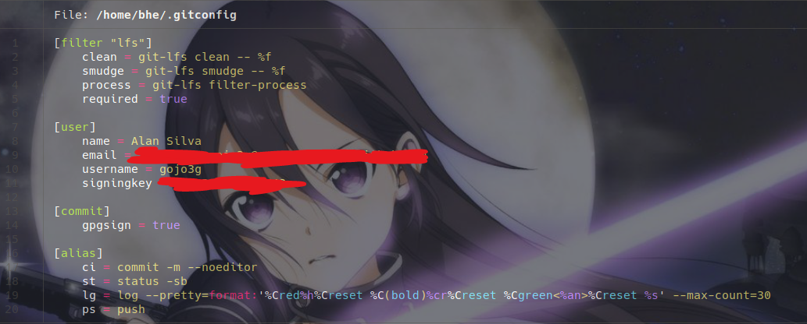
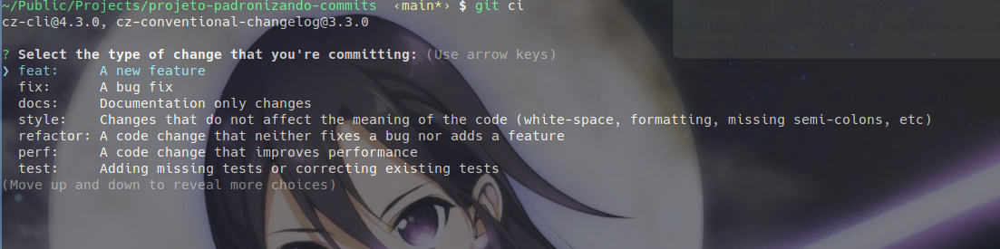

# Padronizando Commits

Assistindo o vídeo do rocketseat de codedrops de número 12. foi possivel criar um projeto node onde o objetivo é padronizar os commits do git.

- Commitlint.js => https://github.com/conventional-changelog/commitlint
- Husky.js => https://github.com/typicode/husky
- Commitizen.js => https://github.com/commitizen/cz-cli

## Instalando o Husky


```sh
yarn husky install
```

## Iniciando um commit

```sh
git add .

git ci
```




